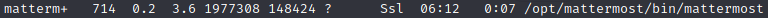

# HTB - Delivery \(easy\)


## Escaneo

Lo primero que hacemos es lanzar varios comandos 'nmap' para localizar los puertos abiertos:


Sobre estos puertos, tratamos de obtener las versiones de los servicios asociados y posibles vulnerbailidades haciendo uso de scripts de nmap:


Obtenemos más información sobre los servicios:

* OpenSSH 7.9p1 Debian.
* Nginx 1.14.2.
* Mattermost.

## Enumeración

A priori no vemos vulnerabilidades en estos servicios que nos permitan un acceso remoto al sistema, por lo que pasamos a analizar la web en el puerto 80:


Apaceren varias URLs en la página principal:

```text
http://delivery.htb/#contact-us
http://helpdesk.delivery.htb
https://html5up.net (este lo ignoramos de momento, ya que es un recurso de Internet)
```

Para poder acceder a las URL con dominio delivery.htb, editamos el fichero '/etc/hosts' de nuestra máquina para que nos resuelva con la IP del servidor:

```text
10.10.10.222    helpdesk.delivery.htb
10.10.10.222    delivery.htb
```

Ya podemos navegar por la web sin errores de resolución de nombres. En el enlace de contacto, encontramos el siguiente texto:


Y un nuevo enlace:

```text
http://delivery.htb:8065/login
```

Accediendo a este enlace, nos aparece una página de login, que además permite la creación de usuarios y reseteo de contraseñas:


Nos quedaría por acceder al enlace de 'helpdesk':


Navegando por cada una de estas páginas, podemos hacernos una idea de cómo es el flujo de creación de tickets y cuentas de usuario.

## Acceso al sistema

En la página principal nos indican que para poder acceder a Mattermost necesitamos una cuenta '@delivery.htb', que no tenemos. Para conseguirla, nos indican que debemos crear un ticket. 


Al crearlo nos dice que podemos actualizar su contenido. bien accediendo a la sección del estado del ticket, o bien enviando un correo a la dirección '&lt;número de ticket&gt;@delivery.htb'. 


¿Qué pasaría por tanto si nos registramos en Mattermost con la dirección de correo que nos facilitaron al crear el ticket? 


Pues que el correo de confirmación del usuario aparece directamente en el estado del ticket:


\(Si no recibimos el correo de activación, probamos a darle a 'recordar contraseña'\):


Accedemos a la URL de confirmación y probamos a acceder a la web de 'Mattermost', encontrándonos con la siguiente información:


Vemos dos cosas interesantes: por un lado lo que parecen ser la contraseña del usuario '**maildeliverer**', que es '**Youve\_G0t:Mail!**', y por otro lado que la contraseña de 'root' podría ser una variante de "**PleaseSubscribe!**". 

Probamos a conectarnos con el usuario 'maildeliverer' y sacamos la flag:



**USER OWN**


## Escalada de privilegios

Del listado de procesos en ejecución, llaman la atención los siguientes:




Accedemos al directorio '/opt/mattermost/' y revisamos todos los subdirectorios y ficheros. En el  fichero de configuración 'config/config.json' encontramos lo que parecen ser las credenciales de la BBDD MariaDB:


Probamos a conectarnos con el usuario y contraseña encontrados:


Una vez conectado a la BBDD, vemos que hay una tabla 'Users'. Probamos a listar todos los registros del usuario 'root':


Podemos ver el hash de su contraseña. Como pudimos ver en el panel principal de Mattermost, la contraseña debe ser una variante de 'PleaseSubscribe!'. A esta contraseña le faltaría un número para cumplir con la política, por lo que probamos a añadírselo al final. 

Para realizar el ataque, usamos la herramienta 'Hashcat'. El cifrado que utiliza Mattermost es bcrypt, que se corresponde con el modo 3200 de Hashcat. Además, le indicamos que realice un ataque por fuerza bruta \(-a 3\), le pasamos el fichero con el valor del hash de la contraseña del usuario root, y por último le indicamos que pruebe con todas las posibles variantes de 'PleaseSubscribe!' más un dígito \(?d\):

```text
hashcat -m3200 -a 3 hash.txt 'PleaseSubscribe!?d'
```


No encontramos la contraseña, por lo que aumentamos a dos dígitos la final:

```text
hashcat -m3200 -a 3 hash.txt 'PleaseSubscribe!?d?d'
```

En esta ocasión, si encontramos la contraseña, 'PleaseSubscribe!21': 


Probamos a conectarnos como 'root' y sacamos la Flag:



**SYSTEM OWN**


